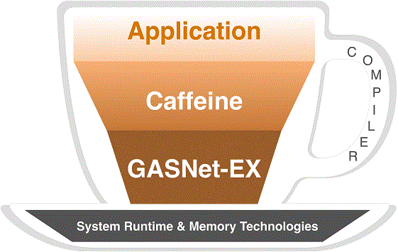

Caffeine
========

**CoArray Fortran Framework of Efficient Interfaces to Network Environments**

Caffeine is a parallel runtime library that aims to support Fortran compilers with a programming-model-agnostic application binary interface (ABI) to various communication libraries.  Current work is on supporting the ABI with the [GASNet-EX] exascale-ready networking middleware.  Future plans include support for an alternative Message Passing Interface ([MPI]) back end.



Prerequisites
-------------
Caffeine leverages the following non-parallel features of Fortran to simplify the writing of a portable, compact runtime-library that supports Fortran's parallel features:

| Feature                                   | Introduced in |
|-------------------------------------------|---------------|
| The `iso_c_binding` module                | Fortran 2003  |
| The `contiguous` attribute [1]            | Fortran 2008  |
| `do concurrent` [2]                       | Fortran 2008  |
| The `ISO_Fortran_binding.h` C header file | Fortran 2018  |
| Assumed-type dummy arguments: `type(*)`,  | Fortran 2018  |
| Assumed-rank dummy arguments: `array(..)`,| Fortran 2018  |

[1] This requirement simplifies development but might be removed in a future release.

[2] This feature is used to support only `co_reduce` and might become optional in a future release.

Download, build, and run an example
-----------------------------------
```
git clone https://github.com/BerkeleyLab/caffeine.git
cd caffeine
./install.sh
export GASNET_PSHM_NODES=8
./build/run-fpm.sh run --example hello
```

Run tests
---------
```
./build/run-fpm.sh test
```

Publications
------------

Citing Caffeine? Please use the following publication:

Damian Rouson, Dan Bonachea.   
"[**Caffeine: CoArray Fortran Framework of Efficient Interfaces to Network Environments**](https://github.com/BerkeleyLab/caffeine/wiki/pubs/Caffeine_for_LLVM-2022.pdf)",     
Proceedings of the [Eighth Annual Workshop on the LLVM Compiler Infrastructure in HPC (LLVM-HPC2022)](https://llvm-hpc-2022-workshop.github.io), November 2022.    
Paper: <https://doi.org/10.25344/S4459B>     
[Talk Slides](https://github.com/BerkeleyLab/caffeine/wiki/pubs/Caffeine_for_LLVM-2022-Slides.pdf)


Documentation
-------------
One of our continuous integration (CI) scripts generates up-to-date Caffeine documentation using [ford].  The CI script also deploys the generated documentation to the our GitHub Pages [site].
Alternatively, generate HTML documentation locally using [ford] as follows:
```
ford doc-generator.md
```
Open `doc/html/index.html` in a web browser.

Funding
-------
The Computer Languages and Systems Software ([CLaSS]) Group at [Berkeley Lab] leads Caffeine development under funding from the Exascale Computing Project ([ECP]).

License
-------
See [LICENSE.txt](LICENSE.txt) for usage terms and conditions.

[GASNet-EX]: https://gasnet.lbl.gov
[CLaSS]: https://go.lbl.gov/class
[Berkeley Lab]: https://lbl.gov
[ECP]: https://www.exascaleproject.org
[ford]: https://github.com/Fortran-FOSS-Programmers/ford
[MPI]: https://www.mpi-forum.org
[ascii.co.uk]: https://ascii.co.uk/art/cup
[site]: https://berkeleylab.github.io/caffeine
